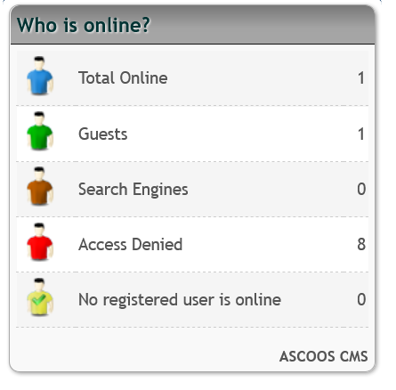
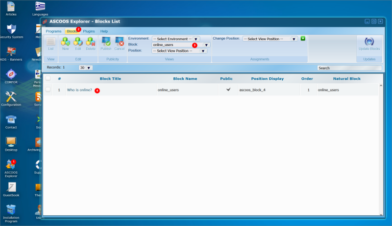
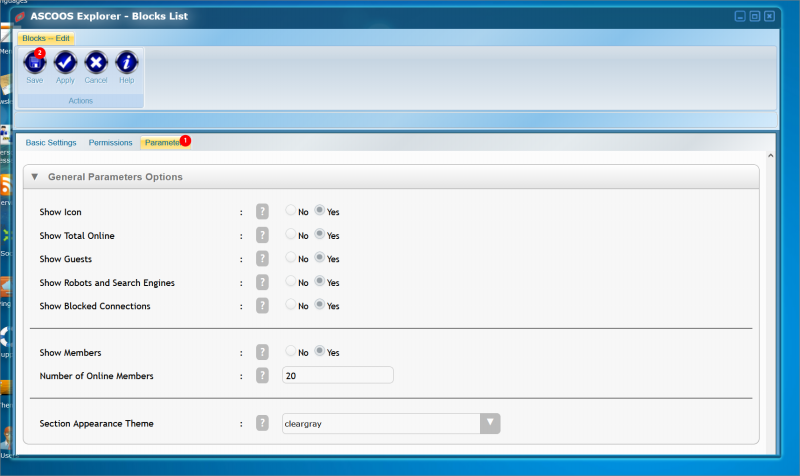

# online_users

## Description

Displays a box containing statistical information about those logged into your Web page.

Content can be displayed in the current or all languages where languages are available.

***

## Management

The block is managed through the ASCOOS Explorer program

 

We can configure its contents from the parameters

***

## Feedback

Please send any feedback or suggestions to [@ascoos](https://x.com/ascoos) (X - Twitter) or [create an issue](https://issues.ascoos.com).

*** 
 
## License

[AGL-F (ASCOOS General License)](http://docs.ascoos.com/lics/ascoos/AGL-F.html)

***

## Download

- [ASCOOS CMS Users Online block from Original Download site](https://dl.ascoos.com/cms/ascoos/ext/blocks/online_users/online_users-latest.zip)

- [ASCOOS CMS  Users Online block from Github](https://github.com/ascoos/online_users/releases)
